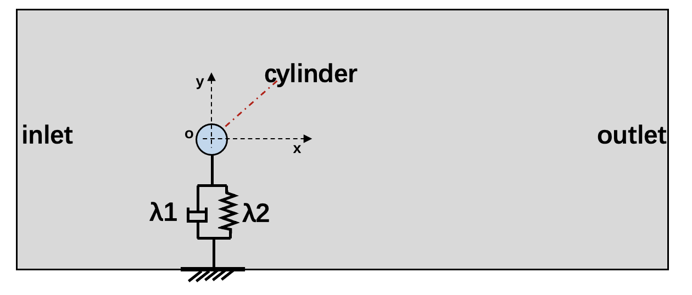
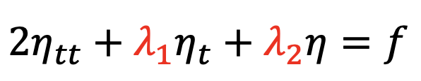
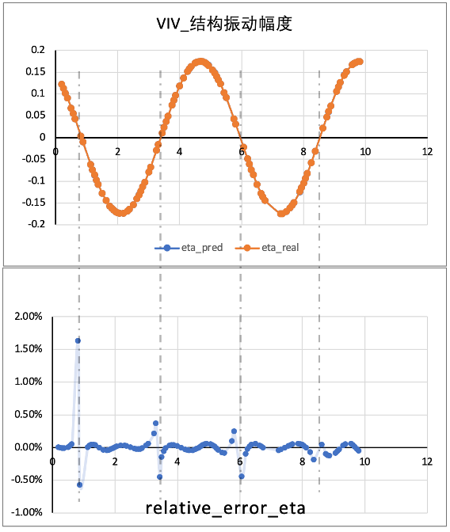
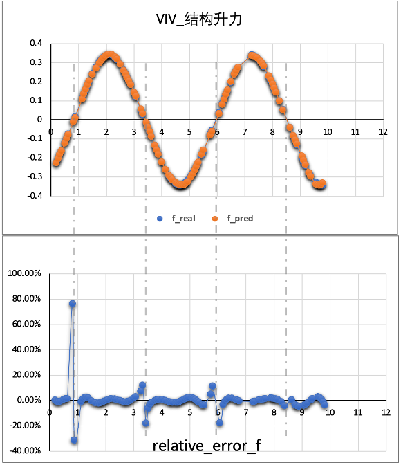

[//]: <> (title: VIV use case tutorial, author: Hui Xiang, Yanbo Zhang, xianghui01@baidu.com)

# VIV(Vortex Induced Vibration)
This guide introduces to how to build a simple VIV model with PINNs in PaddleScience.


## Use case introduction
This use case is a typical inverse problem application. The VIV system is equivalent to a one-dimensional spring-damper system shown as below. 

<div align="center">

</div>


The governing equation is shown as following, and *λ1* and *λ2* represent the natural damping and stiffness of the structure respectively, *ρ* is mass. The aim of this problem is to find *λ1* and *λ2*.
<div align="center">

</div>

In order to verify the feasibility of PINNs method in solving inverse problem, the truth values of stiffness and damping of the system need to be obtained first（*λ1=0，λ2=1.093*）. Comparing the stiffness and damping predicted by the model with the truth value, the relative error is less than 5% which inidicates that the model can well simulate the one-dimensional vibration phenomenon of VIV and can predict the physical properties of the unknown structure, such as some complicated structure.

This model assumes constant reduction velocity is `Ur=8.5（Ur=u/(fn*d))` corresponding to `Re=500`. The lateral amplitude of cylinder vibration(*η*) caused by the velocity fluid passing over the cylinder and the corresponding lift force（*f*） are given in this problem. We laveraged these data as supervised data for the training process. Based on that, the loss funcion is formulated combined with the governing equations. 

## How to run this model

### Install PaddlePaddle and PaddleScience

**Install PaddlePaddle**

The PaddlePaddle development version need to be installed in this problem. User can choose the appropriate version based on simulating platform (such as in linux os and cuda10.1 platform, `python -m pip install paddlepaddle-gpu==0.0.0.post101 -f https://www.paddlepaddle.org.cn/whl/linux/gpu/develop.html` can be used for installing) on the [PaddlePaddle](https://www.paddlepaddle.org.cn/install/quick?docurl=/documentation/docs/zh/develop/install/pip/linux-pip.html) 

**Download PaddleScience code**
 
        
   - Confirm working directory
        
   - Downlaod paddlescience code from  [github](https://github.com/PaddlePaddle/PaddleScience), git clone also works by the following code:   
        
    git clone https://github.com/PaddlePaddle/PaddleScience.git

 **Install dependent libraries**
 
    
   - Rename the folder name as PaddleScience if not
    
   - Change working directory to PaddleScience`cd PaddleScience`
    
   - Install dependent libraries by `pip install -r requirements` 
    
 **Set environment variables**
 
    
   **-Set environment** 
    
   Setting environment by `%env PYTHONPATH=/user_path*/PaddleScience`, and if editing bash files, using `export PYTHONPATH=$PYTHONPATH:/user_path*/PaddleScience/` instead
   
   **-Change working directory**
   Before starting simulaiton, the working directory must be confirmed, and execute`cd ./examples/fsi/`after changing directory to PaddleSciece.  


### Confirm the governing equation 

The governing equations are defined as mentioned above.

### Define the Network
Since only the lateral vibration of the structure is considered and the constant inlet velocity is given, the input of the network is only time(*t*), and the output is the vibration amplitude of the structure.
FCNet is employed as the network with 6 layers and 30 neurons for each layer. The NeuralNetwork was defined in file `./viv_inverse_train.py`as below:

```
PINN = psolver.PysicsInformedNeuralNetwork(layers=6, hidden_size=30, num_ins=1, num_outs=1, 
        t_max=tmax, t_min=tmin, N_f=f.shape[0], checkpoint_path='./checkpoint/', net_params=net_params)
```

### Load data for monitoring
In this model, *η* and *f* were obtained by CFD tools and saved in *./VIV_Training.mat* file. Loading data in file`./viv_inverse_train.py` shown as following:

```
t_eta, eta, t_f, f, tmin, tmax = data.build_data()
```
### Define PDE
PDE is defined in `./paddlescience/module/fsi/viv_pinn_solver.py` as below:
```
def neural_net_equations(self, t, u=None):
    eta = self.net.nn_func(t)
    eta_t = self.autograd(eta, t)
    eta_tt = self.autograd(eta_t, t, create_graph=False)

    rho = 2.0
    k1_ = paddle.exp(self.k1)
    k2_ = paddle.exp(self.k2)
    f = rho*eta_tt + k1_*eta_t + k2_*eta
    return eta, f
```     

### Define the PINN solver
PINN solver is depicted in `./paddlescience/module/fsi/viv_pinn_solver.py`. In this module, the loss function, autograd and optimizer, training methods are defined in detail. Users can modify the loss weight for eq and data during training.
In this model, the eta_weight and eq_weight are 100 and 1 respectively as default.
```
self.eta_weight = 100
```

### Train network
After completing the validation and definition mentioned above, training process can be executed in `python ./viv_inverse_train.py`

```
# Training
batchsize = 150
scheduler = paddle.optimizer.lr.StepDecay(learning_rate=1e-3, step_size=20000, gamma=0.9)
adm_opt = paddle.optimizer.Adam(scheduler, weight_decay=None,parameters=PINN.net.parameters())
PINN.train(num_epoch=100000, batchsize=batchsize, optimizer=adm_opt, scheduler=scheduler)
adm_opt = psci.optimizer.Adam(learning_rate=1e-5, weight_decay=None,parameters=PINN.net.parameters())
PINN.train(num_epoch=100000, batchsize=batchsize, optimizer=adm_opt)
```

### Predict Result
During training process, net_params is saved each 2000 epochs in `./checkpoint` folder, and the latest net_params is used to predict the result of traing time range by executing`python ./viv_inverse_predict.py`. 

```
net_params = '/checkpoint/net_params_100000'
predict(net_params=net_params)
```
The result is shown as below:
<div align="center">


</div>


